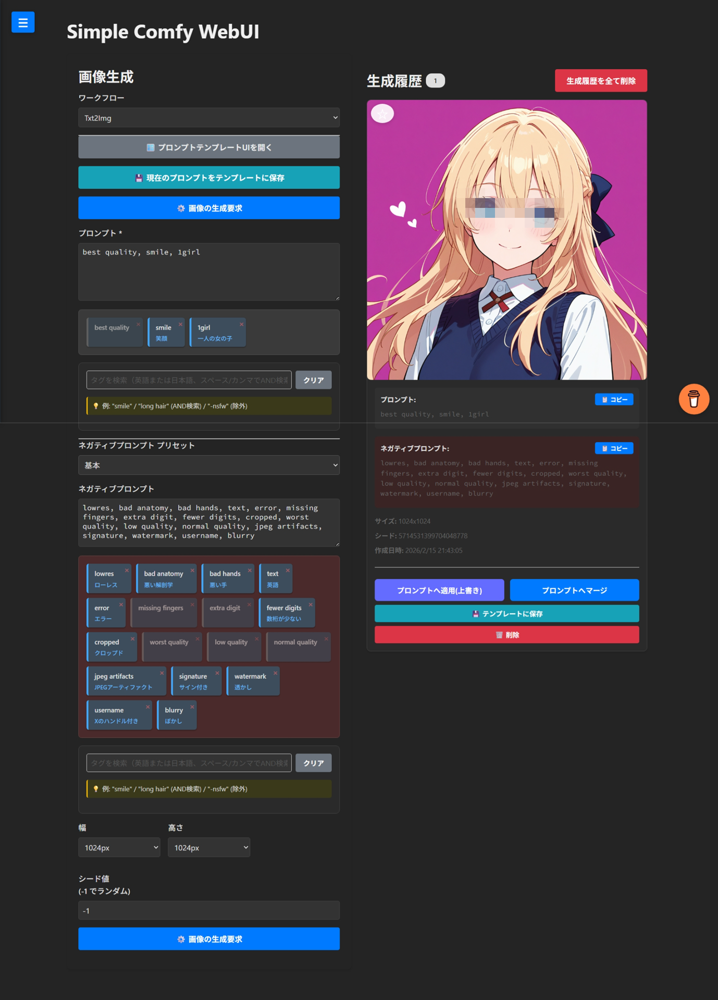

# Simple Comfy WebUI

ComfyUI APIと連携した画像生成Webインターフェース（Vite + TypeScript実装）

過去に「Ultimate Battle Ch****」というアプリケーションで公開してました  
そのガワだけをローカル版としてリビルドしたものがこの「Simple Comfy WebUI」です

## 利用方法
1. ComfyUIを localhost:8188 で起動する
2. Node.js + npm + pnpmをインストールする
3. ターミナルで `pnpm install` を実行して依存関係をインストールする
4. ターミナルで `./start.sh` を実行してアプリケーションを起動する
5. ブラウザで `http://localhost:3000` にアクセスする

## 設定方法
- config/config.yaml を編集して、利用するcheckpointやモデルのパスを指定してください

## セキュリティ設計

本アプリケーションは、**ComfyUI APIエンドポイントをユーザに出さない** 設計になっています

## Pull Requestについて
一切受け付けていません  
各自でフォークして、好きに改造してください

## ライセンス
CC0

## 参考

- ベースリポジトリ: [streamlit-based-comfyui-webtool](https://github.com/0nyx-networks/streamlit-based-comfyui-webtool)
- ComfyUI: [https://github.com/comfyanonymous/ComfyUI](https://github.com/comfyanonymous/ComfyUI)
